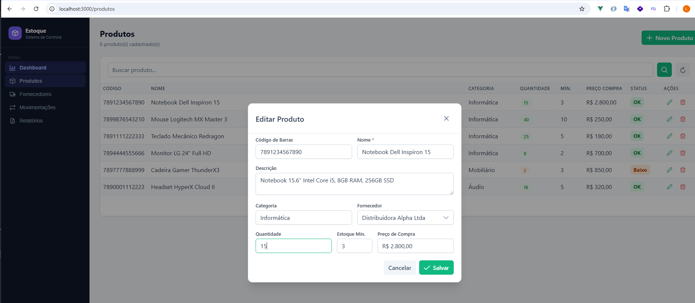

# estoque-front

Frontend SPA da aplicação **Sistema de Controle de Estoque**.

> Documentação completa: veja o [README principal](../README.md)



## Stack

- **Vue 3** (Composition API) + **TypeScript**
- **Vite 5** — build tool e dev server
- **PrimeVue 4** + tema Aura — componentes UI (DataTable, Dialog, Toast…)
- **Pinia** — gerenciamento de estado (autenticação)
- **Vue Router 4** — rotas com guards `requiresAuth` / `guest`
- **Axios** — cliente HTTP com interceptor JWT automático
- **Tailwind CSS v4** (utilities only) — layout e espaçamento

## Estrutura

```
src/
├── api/
│   ├── axios.ts       # Instância Axios + interceptor JWT + redirect 401
│   └── index.ts       # Funções para todos os endpoints da API
├── stores/
│   └── auth.ts        # Pinia store: login, logout, fetchUser
├── router/
│   └── index.ts       # Rotas + beforeEach guard
├── components/
│   └── AppLayout.vue  # Sidebar de navegação
└── views/
    ├── LoginView.vue
    ├── DashboardView.vue
    ├── produtos/ProdutosView.vue
    ├── fornecedores/FornecedoresView.vue
    ├── movimentacoes/MovimentacoesView.vue
    └── relatorios/RelatoriosView.vue
```

## Executar com Docker

```bash
# na pasta estoque-api (docker-compose.yml)
docker-compose up --build -d frontend
```

Acesse: http://localhost:3000

## Executar localmente

```bash
npm install
npm run dev        # http://localhost:5173
```

## Variáveis de ambiente (`.env`)

```env
VITE_API_URL=http://localhost:8080
```

## Paginação server-side

As tabelas de Produtos, Fornecedores e Movimentações usam `lazy` DataTable do PrimeVue — cada troca de página envia `?page=N&per_page=10` para a API, sem carregar todos os registros de uma vez.
